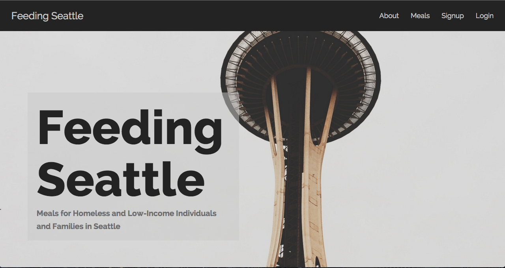

# Feeding Seattle
Uses Socrata Open Data to display a list of meal programs for homeless and low-income individuals. Registered users can create a list of saved/favorite programs. 



####Want to Contribute?
In order to make this site as useful as possible for the people it aims to serve, I welcome pull requests and other contributions.
#####Node Dependencies
* bcrypt
* body-parser
* express
* express-jwt
* jsonwebtoken
* mongoose

#####Bower Components
* ngmap

####How-To/About from Site
You can view meal information without being a registered user, but you need to register in order to create a printable list of favorites. To register, simply sign up with a username and password that you'll be able to remember. You can filter meals by those that are open to everyone or those restricted by demographic. Just click the button in the meal's drop-down panel to add it to your favorites list.

If you aren't looking for meals but would like to support these programs and services by donating your time or money, check out the organizations on the right side of this page.

####User Stories
* User Story 1: This user is homeless and living in a shelter without a food program. She frequently uses the library as daytime shelter and for the internet. She can create a favorites page and print it out to have a list of the food programs that work best for her without having to use the computer every day.
* User Story 2: This user is low-income and uses a smartphone as their main way of accessing the internet. He can easily create a list of meal programs that work well for him using Feeding Seattle and reference them on his phone as needed.
* User Story 3: This user wants to help volunteer for or donate money to a meal program in Seattle. She can find ones near her and/or during times that she is free and then use the contact info on the about page to reach out about volunteering, or simply donate to the program if she'd prefer to help them monetarily. 

####Database Model

```javascript
var UserSchema = mongoose.Schema({
  username: {
    type: String,
    required: true,
    unique: true
  },
  password: {
    type: String,
    required: true
  },
  favorites: [
    {
      program: String,
      location: String,
      time: String,
      meal: String,
      served: String
    }
  ]
});
```

####Wireframes
* Splash page: https://drive.google.com/file/d/0BwTLtk98IjeBV1IyYWxXRVhTcGc/view?usp=sharing
* About page: https://drive.google.com/file/d/0BwTLtk98IjeBdEFqSmswU2V1OFk/view?usp=sharing
* Meals page: https://drive.google.com/file/d/0BwTLtk98IjeBaFUyVnc2enNCVWs/view?usp=sharing
* Favorites page: https://drive.google.com/file/d/0BwTLtk98IjeBMGpVbjdCdkprbEk/view?usp=sharing

####Highlights
* Registered users can add and remove favorites from a personal page
* Separate CSS for readable printed pages
* Users can filter the list of meal programs by meal served, meals that are open to everyone, or meals that are only open to certain demographics
* Mobile and web design
* About page has contact info for the programs that provide meals, allowing those who'd like to volunteer their time and/or money to these programs to do so

####Technologies Used
* HTML5/CSS3
* JavaScript
* AngularJS
* Node.js
* Express
* MongoDB/NoSQL
* Socrata Open Data API
* Heroku
* Bootstrap
* BootstrapUI for AngularJS
* NgMap (Google Maps for AngularJS)
* Font Awesome
* Google Fonts

####Biggest Challenges and Things I Would Change
* Some of the markers for the venue locations don't show up on the Google maps, and I'm not sure why. The maps also don't always render beyond a grey box, and will only center on the correct location sometimes. I think some of this has to do with the Angular plug-in I used, and were I to do the project over, I would use a different plug-in. 
* Had to work around the XHTTP header being sent when a user was logged in to be able to access the data from the Socrata API endpoint. Originally, the data would only display if the user was logged out.
* I had really wanted to have a map page that showed all of the locations together, but had a lot of issues with making sure that all of the markers showed up and using an ng-repeat on pop-ups that would appear with info when a marker was clicked. Going back to my first challenge with the maps, I think that a different plug-in might be the key.
* Working on adding flash messages if a username is taken for a new user (currently will simply not allow the user to be created) or if the password and username don't match for a returning user.
